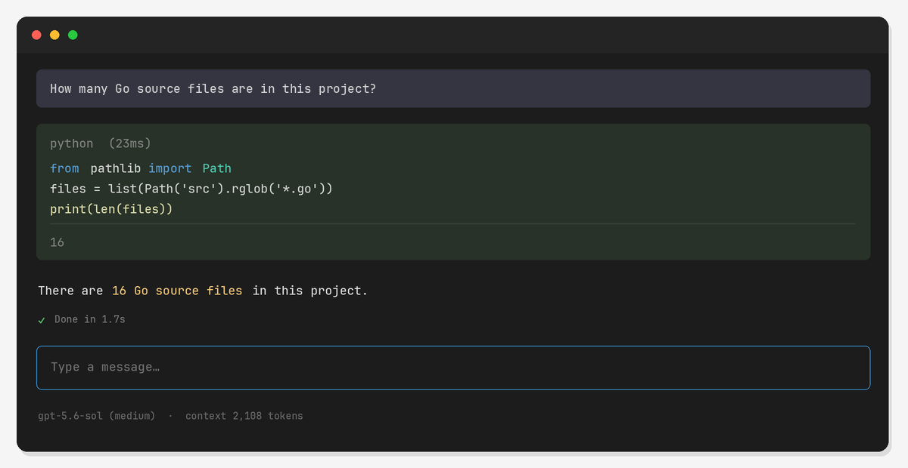

<h1 align="center">fn agent</h1>

<p align="center"><strong>A programmable terminal agent.</strong></p>

<p align="center">
  <a href="src/go.mod"></a>
  <a href="#requirements"></a>
  <a href="LICENSE"></a>
</p>

<p align="center">
  
</p>

`fn` gives a model one persistent Python environment for reasoning, tools,
and working memory. Python variables, imports, and results survive across calls, so
the agent can keep large state outside model context and inspect only what it needs.
The agent loop stays explicit: one model-facing REPL tool, a few composable functions,
and no framework hidden underneath.

## Benchmarks

On the 15-task HarnessBench quick suite, fn agent achieved a **0.8648 mean
outcome score**, compared with **0.8277 for Codex** and **0.8275 for Pi** using
the same model and reasoning level, with no adapter failures. See the
[methodology](src/benchmarks/harnessbench/README.md) and
[detailed results](src/benchmarks/harnessbench/results.html).

## Requirements

- Go 1.26 or newer
- Python 3.10 or newer (`python3`)
- An API key for the configured model provider

## Run

```sh
cd src
export OPENAI_API_KEY='...'
go run ./cmd/fn
```

To build a local binary:

```sh
cd src
go build -o fn ./cmd/fn
./fn
```

For non-interactive use, print only the final response to stdout. Piped input is
appended to the prompt:

```sh
fn -p "summarize the changes in this repository"
git diff | fn -p "review this diff"
cat error.log | fn --print "find the root cause"
```

## Configuration

Set the API key with `OPENAI_API_KEY`. fn agent also supports these optional overrides:

| Variable | Default |
| --- | --- |
| `FN_BASE_URL` | `https://api.openai.com/v1/` |
| `FN_MODEL` | `gpt-5.6-sol` |
| `FN_REASONING_EFFORT` | `medium` |

When a model rejects a request because its context limit was reached, fn agent
summarizes older context, preserves approximately 20,000 recent tokens verbatim,
and retries once.

For local servers that ignore authentication, use any non-empty API key. Custom
endpoints must support `POST /responses`, including function tool calls.

## Persistent REPL

The model works through a persistent Python REPL with three preloaded functions:

```python
status = shell("git status --short")
status.stdout

hits = web_search("latest Go release")
[(hit.title, hit.url) for hit in hits]

reviews = [llm(f"Classify this report:\n{report}") for report in reports]
```

- `shell()` returns a `ShellResult` with `stdout`, `exit_code`, and `error` fields.
- `web_search()` returns `SearchResult` values with `title`, `url`, and `snippet`.
- `llm()` runs one fresh, tool-free model call and returns its response as a string.

Assignments stay in the REPL; only printed output and the final expression enter
model context. After a turn, its reasoning and REPL results remain visible in the
terminal but are omitted from future requests. User messages, final responses, REPL
code, and Python state persist.

## MCP

fn agent keeps MCP out of its core. It uses
[MCPorter](https://mcporter.sh) through `shell()` to discover and invoke configured
servers only when needed:

```sh
npx -y mcporter@latest list
npx -y mcporter@latest call <server>.<tool> key=value
```

MCPorter manages its own configuration and credentials. It requires Node.js and may
download the package on first use.

## Web search

`web_search()` is backed by DuckDuckGo and requires no separate API key. It returns
ranked titles, URLs, and snippets; full pages can still be inspected with
`shell("curl ...")`.

## Controls

- `Enter` — send a message; while responding, steer after the current tool-call batch
- `Shift+Enter` — queue a follow-up until the active response finishes
- `Ctrl+J` — insert a newline
- `↑` / `↓` — navigate submitted messages and return to the current draft
- `Ctrl+C` — cancel the active response; press twice within one second to quit
- `Escape` — clear the editor
- `Ctrl/Alt+←/→` or `Alt+B/F` — move by word
- `Ctrl+W`, `Alt+D`, `Ctrl+U`, `Ctrl+K` — delete words or surrounding text

Reasoning summaries stream as italic gray text. REPL calls appear as Python cells,
and model-visible output is capped at 2,000 lines or 50KB. Primary-screen rendering
keeps terminal scrollback, selection, search, and copying native. Distinguishing
`Shift+Enter` requires terminal keyboard-enhancement support.

## Test

```sh
cd src
go test ./...
go test -race ./...
go vet ./...
./testdata/tmux-e2e.sh
```

## Safety

fn agent executes Python and shell commands with the permissions of the current user.
The REPL is not a sandbox. Run it only where that access is appropriate.
## License

[BSD 2-Clause](LICENSE)
