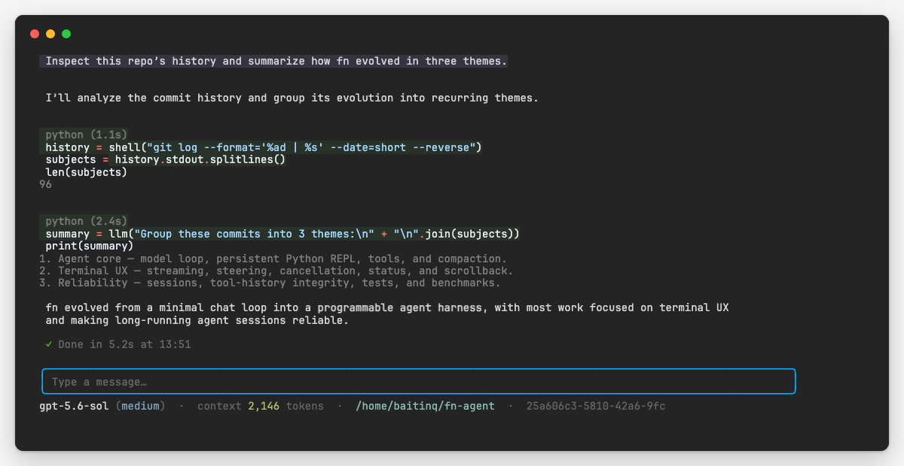

<h1 align="center">fn agent</h1>

<p align="center"><strong>A minimal agent harness where Python is the tool protocol and durable working memory.</strong></p>

<p align="center">
  <a href="src/go.mod"></a>
  <a href="#requirements"></a>
  <a href="LICENSE"></a>
</p>

<p align="center">
  
</p>

`fn` gives a model one persistent Python environment for reasoning, tools,
and working memory. Python variables, imports, and results survive across calls, so
the agent can keep large state outside model context and inspect only what it needs.
The agent loop stays explicit: one model-facing REPL tool, a few composable functions,
and no framework hidden underneath.

## Benchmarks

fn is evaluated against Pi and Codex with `gpt-5.6-sol` at medium reasoning.

| Harness | SWE Atlas score | Tokens | HarnessBench score | Tokens |
| --- | ---: | ---: | ---: | ---: |
| **fn agent** | **37.5%** | 25.24M | 87.02% | **1.91M** |
| Pi | 35.0% | **21.49M** | **87.30%** | 4.27M |
| Codex | 30.0% | 82.12M | 84.94% | 7.38M |

fn scored competitively while using 55–74% fewer tokens on HarnessBench and
69% fewer than Codex on SWE Atlas. See [BENCHMARKS.md](BENCHMARKS.md) for details.

## Install

Install the latest version with Go:

```sh
go install github.com/Baitinq/fn-agent/src/cmd/fn@latest
```

Make sure Go's binary directory is in your `PATH`. By default, this is
`$HOME/go/bin`:

```sh
export PATH="$PATH:$(go env GOPATH)/bin"
```

## Requirements

- Go 1.26 or newer
- Python 3.10 or newer (`python3`)
- An API key for the configured model provider

## Run

```sh
cd src
export OPENAI_API_KEY='...'
go run ./cmd/fn

# Gemini (API-key authentication)
export GEMINI_API_KEY='...'
FN_MODEL=gemini-3.7-flash go run ./cmd/fn

# Anthropic (API-key authentication)
export ANTHROPIC_API_KEY='...'
FN_MODEL=claude-sonnet-5 go run ./cmd/fn
```

## Sessions

`fn` starts a new session by default and shows its UUID in the status line. Sessions are saved under `~/.fn/sessions` after each response. Resume one explicitly with:

```sh
fn --session <UUID>
```

Conversation context and per-response token usage are stored in `session.json`.
Python REPL variables are restored on a best-effort basis using Python's standard `pickle` support; values that cannot be pickled are skipped. Sessions must be resumed from the directory where they were created.

## Configuration

Set `OPENAI_API_KEY`, `GEMINI_API_KEY`, or `ANTHROPIC_API_KEY` for the corresponding provider. Model names beginning with `gemini-` select Google's native Generative AI API; names beginning with `claude-` select Anthropic's native Messages API. Gemini and Anthropic use API-key authentication directly; OAuth and Vertex AI are not used.

| Variable | Default |
| --- | --- |
| `FN_PROVIDER` | inferred from `FN_MODEL` (`openai`, `gemini`, or `anthropic`) |
| `FN_BASE_URL` | provider API URL |
| `FN_MODEL` | `gpt-5.6-sol` |
| `FN_REASONING_EFFORT` | `medium` |

When a model rejects a request because its context limit was reached, fn agent
summarizes older context, preserves approximately 20,000 recent tokens verbatim,
and retries once.

For local OpenAI-compatible servers that ignore authentication, use any non-empty API key. OpenAI-compatible endpoints must support `POST /responses`, including function tool calls.

## Persistent REPL

The model works through a persistent Python REPL with three preloaded functions:

```python
status = shell("git status --short")
status.stdout

hits = web_search("latest Go release")
[(hit.title, hit.url) for hit in hits]

reviews = [llm(f"Classify this report:\n{report}") for report in reports]
```

- `shell()` returns a `ShellResult` with `stdout`, `exit_code`, and `error` fields.
- `web_search()` returns `SearchResult` values with `title`, `url`, and `snippet`.
- `llm()` runs one fresh, tool-free model call and returns its response as a string.

Assignments stay in the REPL; only printed output and the final expression enter
model context. After a turn, its reasoning and REPL results remain visible in the
terminal but are omitted from future requests. User messages, final responses, REPL
code, and Python state persist.

## MCP

fn agent keeps MCP out of its core. It uses
[MCPorter](https://mcporter.sh) through `shell()` to discover and invoke configured
servers only when needed:

```sh
npx -y mcporter@latest list
npx -y mcporter@latest call <server>.<tool> key=value
```

MCPorter manages its own configuration and credentials. It requires Node.js and may
download the package on first use.

## Web search

`web_search()` is backed by DuckDuckGo and requires no separate API key. It returns
ranked titles, URLs, and snippets; full pages can still be inspected with
`shell("curl ...")`.

## Controls

- `Enter` — send a message; while responding, steer after the current tool-call batch
- `Shift+Enter` — queue a follow-up until the active response finishes
- `Ctrl+J` — insert a newline
- `↑` / `↓` — navigate submitted messages and return to the current draft
- `Ctrl+↑` — move all queued messages back to the editor
- `Ctrl+C` — cancel the active response; press twice within one second to quit
- `Escape` — clear the editor
- `Ctrl/Alt+←/→` or `Alt+B/F` — move by word
- `Ctrl+W`, `Alt+D`, `Ctrl+U`, `Ctrl+K` — delete words or surrounding text

Reasoning summaries stream as italic gray text. REPL calls appear as Python cells,
and model-visible output is capped at 2,000 lines or 50KB. Primary-screen rendering
keeps terminal scrollback, selection, search, and copying native. Distinguishing
`Shift+Enter` requires terminal keyboard-enhancement support.

## Build and non-interactive use

To build a local binary:

```sh
cd src
go build -o fn ./cmd/fn
./fn
```

For non-interactive use, print only the final response to stdout. Piped input is
appended to the prompt:

```sh
fn -p "summarize the changes in this repository"
git diff | fn -p "review this diff"
cat error.log | fn --print "find the root cause"
```

Use `--json` with print mode to emit one JSONL record per model response with its
input, cached input, output, reasoning, and total token usage, followed by the final
result:

```sh
fn -p --json "summarize the changes in this repository"
```

## Test

```sh
cd src
go test ./...
go test -race ./...
go vet ./...
./testdata/tmux-e2e.sh
```

## Safety

fn agent executes Python and shell commands with the permissions of the current user.
The REPL is not a sandbox. Run it only where that access is appropriate.
## License

[BSD 2-Clause](LICENSE)
